# Traveling Salesman Problem (TSP) Solver Suite

This repository contains implementations of various algorithms for solving the Traveling Salesman Problem (TSP), including a novel hierarchical approach called Hylos. This work was completed as part of UNIST CSE331 Assignment #2.

## Algorithms Implemented

1. **MST-based 2-approximation**

   - Classical heuristic using Minimum Spanning Tree
   - Time Complexity: O(n² log n)
   - Approximation Ratio: ≤ 2

2. **Christofides with Edmonds' Blossom**

   - Uses perfect matching on odd-degree vertices
   - Time Complexity: O(n⁴)
   - Approximation Ratio: ≤ 1.5

3. **Christofides with Gabow's Blossom**

   - Optimized implementation of Christofides
   - Time Complexity: O(n³)
   - Approximation Ratio: ≤ 1.5

4. **Held-Karp Dynamic Programming**

   - Exact algorithm for optimal solutions
   - Time Complexity: O(n² · 2ⁿ)
   - Optimal (ratio = 1.0)
   - Practical for n ≤ 22

5. **Hylos (Hierarchically Localized Optimization Strategy)**
   - Novel scalable algorithm combining clustering with hybrid solving
   - Adaptive complexity based on problem size
   - Competitive approximation ratios with superior scalability

## Build Instructions

### Prerequisites

- C++ compiler supporting C++17 or later
- Make build system
- Python 3.8+ (for visualization)
- Required Python packages: numpy, matplotlib, networkx

### Building the Project

1. Clone the repository:

```bash
git clone https://github.com/ohdoyoel/unist_cse331_assignment_2.git
cd unist_cse331_assignment_2
```

2. Build using make:

```bash
make all
```

This will compile all algorithms and create the necessary executables.

## Usage

### Running Individual Algorithms

```bash
# MST 2-approximation
./src/mst2approx <input_file>.tsp <input_file>.tour

# Christofides with Edmonds
./src/christofides_edmonds <input_file>.tsp <input_file>.tour

# Christofides with Gabow
./src/christofides_gabow <input_file>.tsp <input_file>.tour

# Held-Karp (for small instances)
./src/heldkarp <input_file>.tsp <input_file>.tour

# Hylos
./src/hylos <input_file>.tsp <input_file>.tour
```

### Running Benchmarks

To run all algorithms on a test instance and compare results:

```bash
# MST 2-approximation, Christofides with Edmonds, Christofides with Gabow, Held-Karp
./run_experiments.sh

# Hylos
./run_hylos.sh [--debug]

# mona-lisa100k
./run_mona-lisa100k.sh
```

## Test Datasets

The implementation has been tested on various TSPLIB instances:

- ulysses16 (16 cities)
- ulysses22 (22 cities)
- a280 (280 cities)
- xql662 (662 cities)
- kz9976 (9,976 cities)
- mona-lisa100k (100,000 cities)

## Performance Results

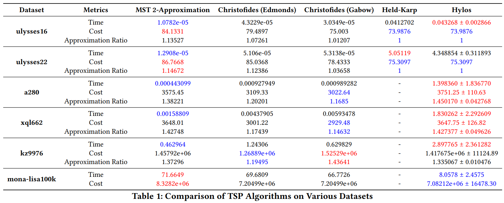

## Runtime Analysis

The empirical runtimes across all algorithms and datasets are consistent with the theoretical time complexities of each method:

- **MST 2-Approximation** (O(n²)) is the fastest in all cases, requiring under 2 ms even for the largest dataset (mona-lisa100k).
- **Christofides (Edmonds/Gabow)** scale polynomially (O(n⁴) / O(n³)), showing higher overhead on large instances: 0.6-1.2s on kz9976 and over a minute on mona-lisa100k.
- **Held-Karp** (O(n² · 2ⁿ)) is tractable only for small datasets such as ulysses16 and ulysses22, and fails to terminate on larger inputs.
- **Hylos** adapts dynamically to input scale. Although slightly slower on small datasets due to clustering overhead, it clearly outperforms other methods on large-scale inputs. For example, on kz9976, Hylos completes in 2.89s on average, compared to 1.24s (Edmonds) and 0.63s (Gabow). However, the advantage is most evident on mona-lisa100k, where Christofides variants exceed 66 seconds, while Hylos remains under 10 seconds.

## Approximation Quality

All algorithms are compared against ground-truth costs provided by TSPLIB and TTD. The results confirm a classic trade-off between runtime and solution quality:

- **MST 2-Approximation** yields the worst ratios—up to 1.38 on a280 and 1.43 on xql662—matching its known theoretical bounds (2).
- **Christofides (Gabow)** offers the best heuristic performance, achieving approximation ratios of 1.15 on xql662 and 1.44 on kz9976 - under bounds (1.5).
- **Held-Karp** serves as the benchmark, producing optimal solutions with approximation ratios 1.0 on small datasets.
- **Hylos** strikes a practical balance. It achieves competitive approximation ratios such as 1.45 (a280), 1.43 (xql662), and 1.33 (kz9976), while remaining efficient. On mona-lisa100k, Hylos produces the lowest cost among heuristics, outperforming Christofides by approximately 1.71%.

Overall, Hylos demonstrates strong scalability and quality, validating its use for real-world TSP scenarios where exact solutions are impractical.

## Visualization

### ulysses16

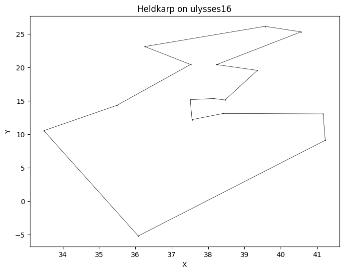

|         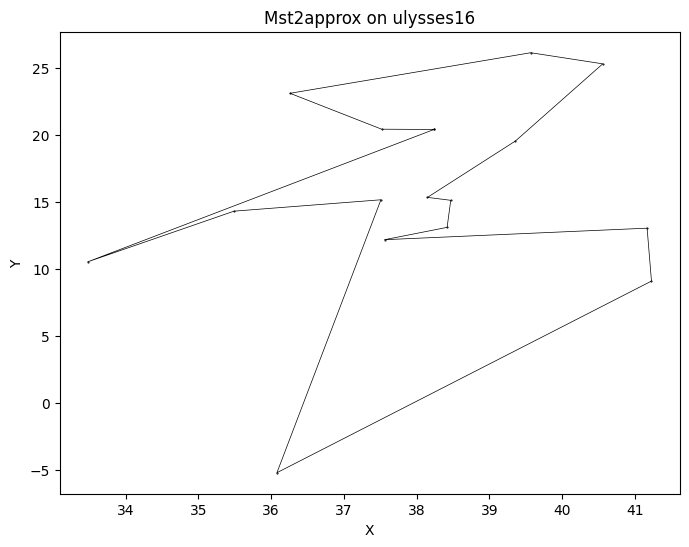         | 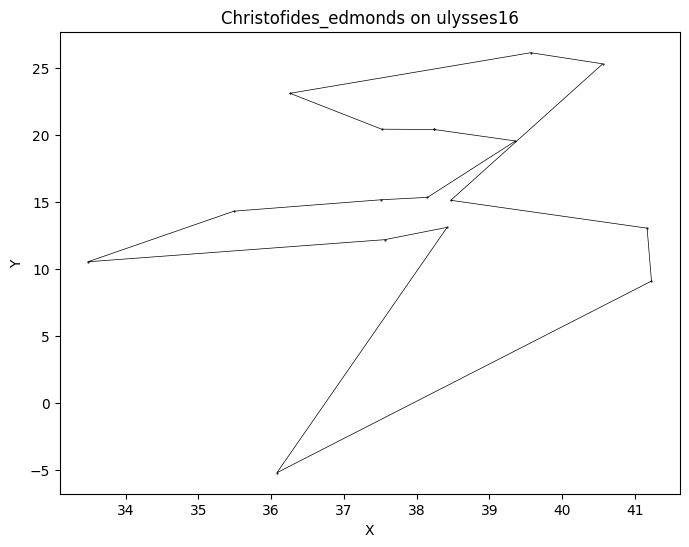 |
| :----------------------------------------------------------------------: | :--------------------------------------------------------------------------: |
| 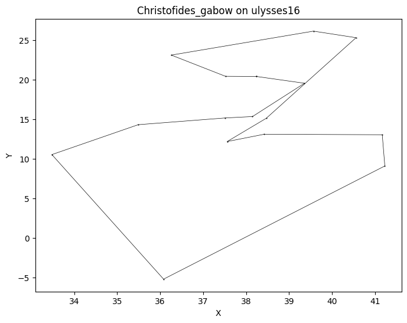 |                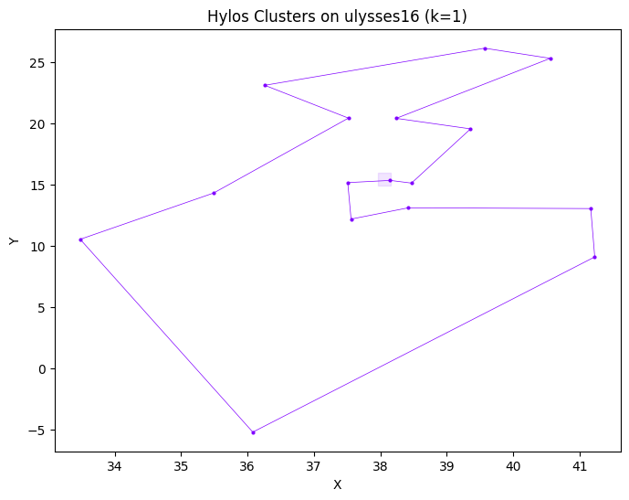                |

### ulysses22


|         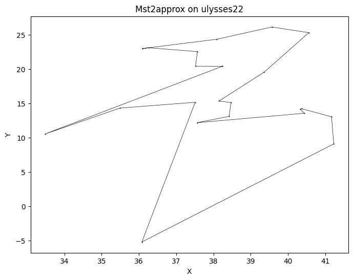         | 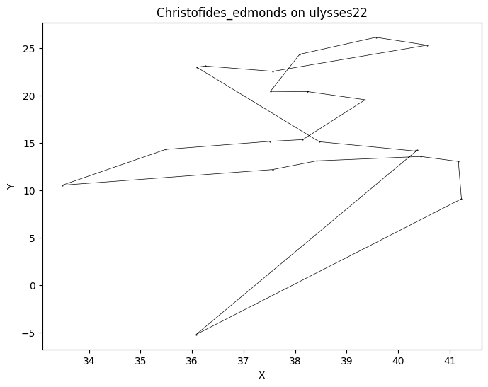 |
| :----------------------------------------------------------------------: | :--------------------------------------------------------------------------: |
| 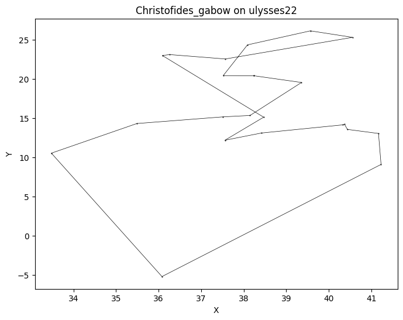 |                                |

### a280

|         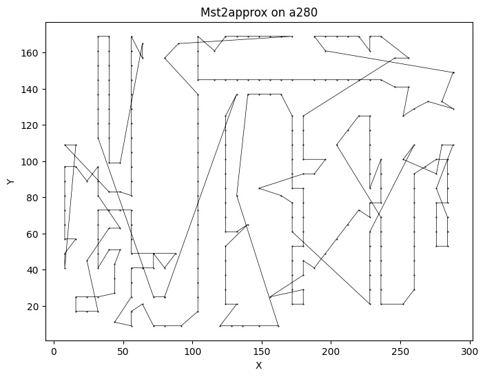         | 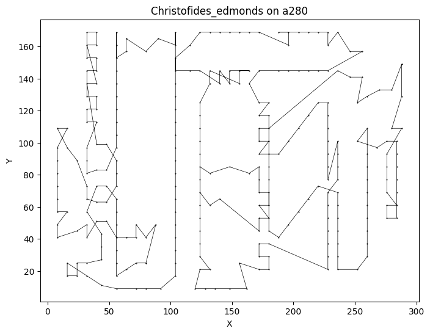 |
| :------------------------------------------------------------: | :----------------------------------------------------------------: |
| 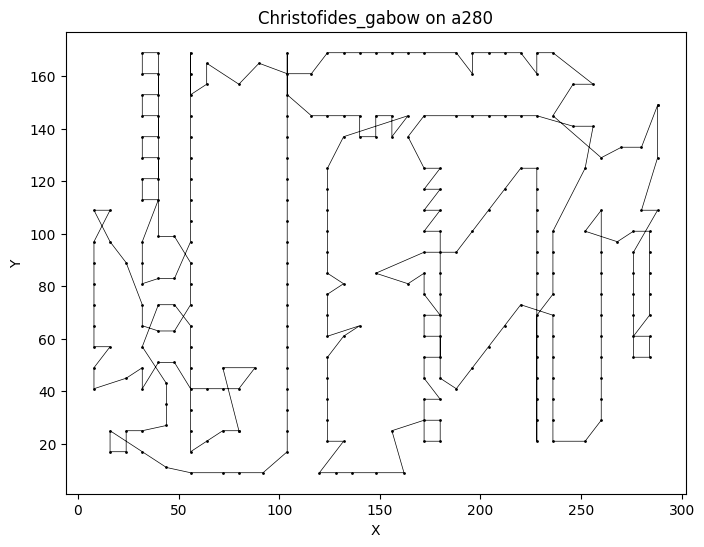 |                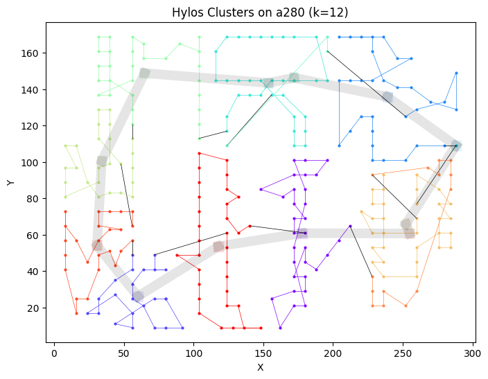                |

### xql662

|         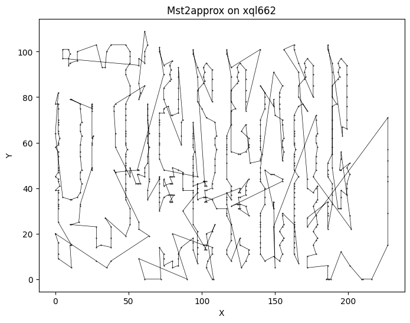         | 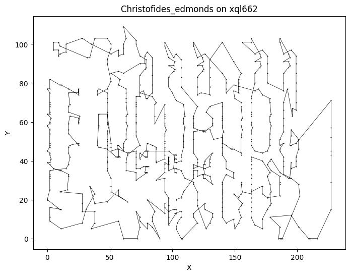 |
| :----------------------------------------------------------------: | :--------------------------------------------------------------------: |
| 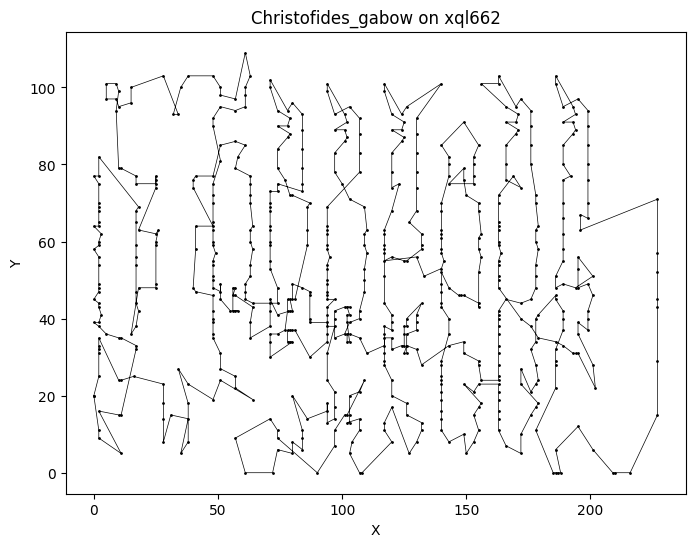 |                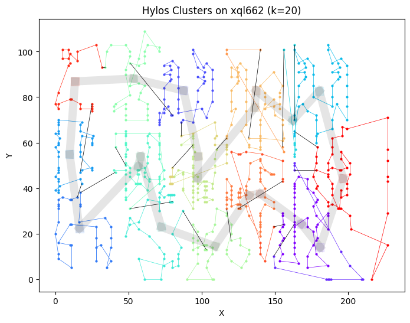                |

### kz9976

|         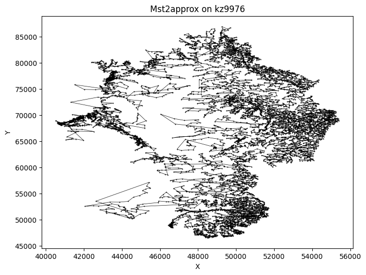         | 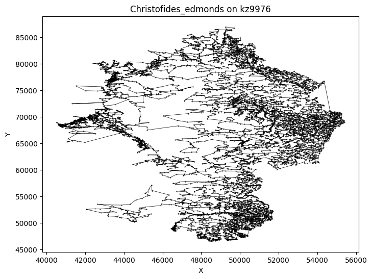 |
| :----------------------------------------------------------------: | :--------------------------------------------------------------------: |
|  |                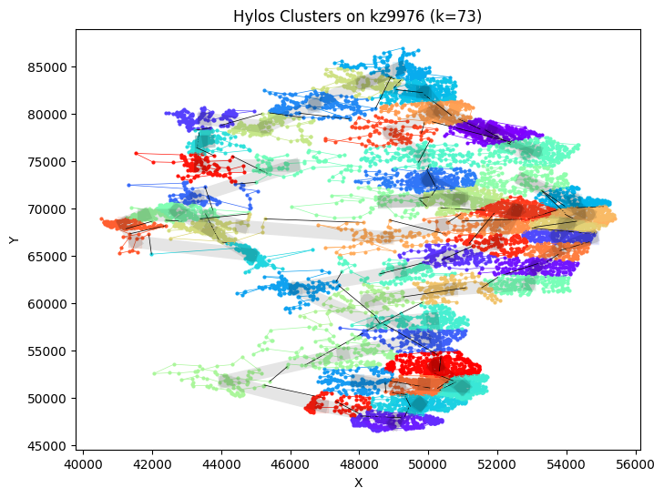                |

### mona-lisa100k

|         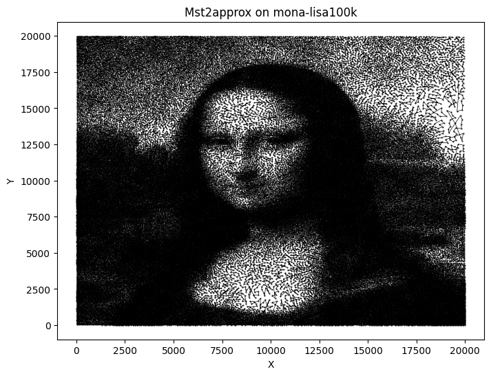         | 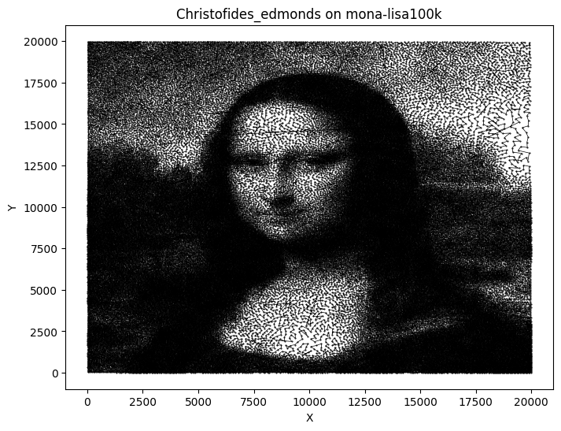 |
| :------------------------------------------------------------------------------: | :----------------------------------------------------------------------------------: |
|  |                                |

## Paper

The full paper (including algorithm, experiments, and figures) is available in this repository, [here](report/report.pdf).

## Author

Doyeol Oh (20211187)  
UNIST, South Korea  
ohdoyoel@unist.ac.kr

## License

This project is licensed under the MIT License - see the LICENSE file for details.

---

For questions or feedback, please contact [ohdoyoel@unist.ac.kr](mailto:ohdoyoel@unist.ac.kr).
